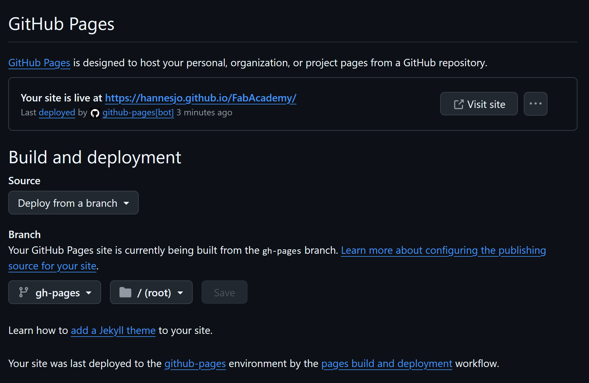

# Setting up this Homepage

I decided to follow the recommendation from my supervisor and use *Markdown* as a base for my homepage. To learn the syntax I used this [guide](https://www.markdownguide.org/basic-syntax/). 

The tutorial I found most helpful is on [Youtube](https://www.youtube.com/watch?v=Q-YA_dA8C20).

## Preparation
First it is required to set up [VSCode](https://code.visualstudio.com/) and [Python](https://www.python.org/). 

**Remeber to select "Add Python to PATH" during the installation of Python.**

Next, you need a [GitHub](https://github.com) Account and create a new repository there. 

Then I installed the Python Extension in VSCode under Extensions.

When in VSCode on the Welcome screen select **Clone Git Repository** and choose the repository GitHub. 

Next, the Markdown libraries need to be installed via the terminal. Material is a theme, that might be useful, but is not required.

```
pip install mkdocs

pip install mkdocs-material
```
## Creating a new webpage
Now it is time to create the basic files and directories needed for the webpage. 
```
mkdocs new .
```
The file structure is now visible in the Explorer and the file index.md is the frontpage. 

The file mkdocs.yml is used for some settings as defining the url, the theme and site title. 
```
site_name: My Pre-FabAcademy Hompeage
site_url: https://hannesjo.github.io/FabAcademy/
theme:
  name: material
```
Use the command 
```
mkdocs serve
```
to create the actual html webpage and preview it in the browser by clicking on the link in the terminal. 

Watch out: if using the *venv* virtual environment as suggested in the tutorial, you cannot have the mkdocs library install locally as well. 
Check with 
```
mkdocs --version
```
if it is installed locally and use
```
pip uninstall mkdocs
```
to remove it. 

## Transfering the files to GitHub
Now it's time to upload the files to GitHub. Use the commit button in the **Source Control** tab and remember to write a short message. Then click on sync changes. If it's the first time syncing to GitHub you need to set the login and password. 
```
git config --global user.email "you@example.com"
git config --global user.name "Your Name"
```

## Creating the page on GitHub
The files should be visible in the repository, now. 
Go to Settings - Pages and select the branch and save. 

After a refresh you should see the link to your webpage.

## Finetuning the homepage using packages
When everything was finally running, I added some features to the homepage by modifying the mkdocs.yml file (according to the [Mkdocs-material documentation](https://squidfunk.github.io/mkdocs-material/setup/)). 

One thing that is good to know is the format of the url, when using hyperlinks or inserting images. Make sure to use the relative format depending on the location of the webpage in the directory. 
```
(../images/github_pages.png)
```