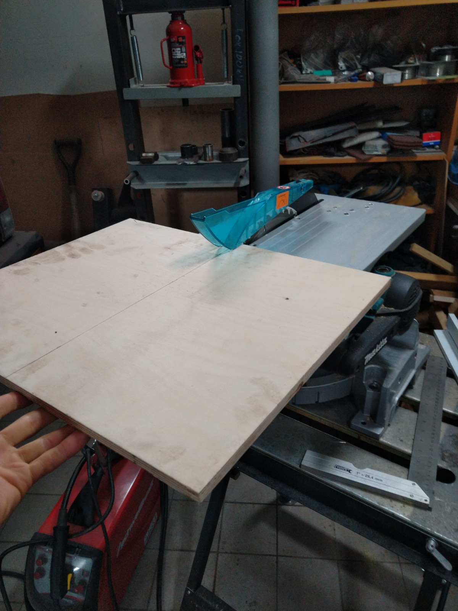
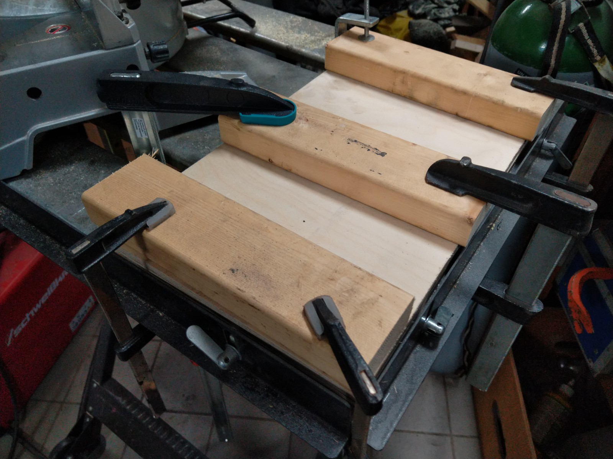
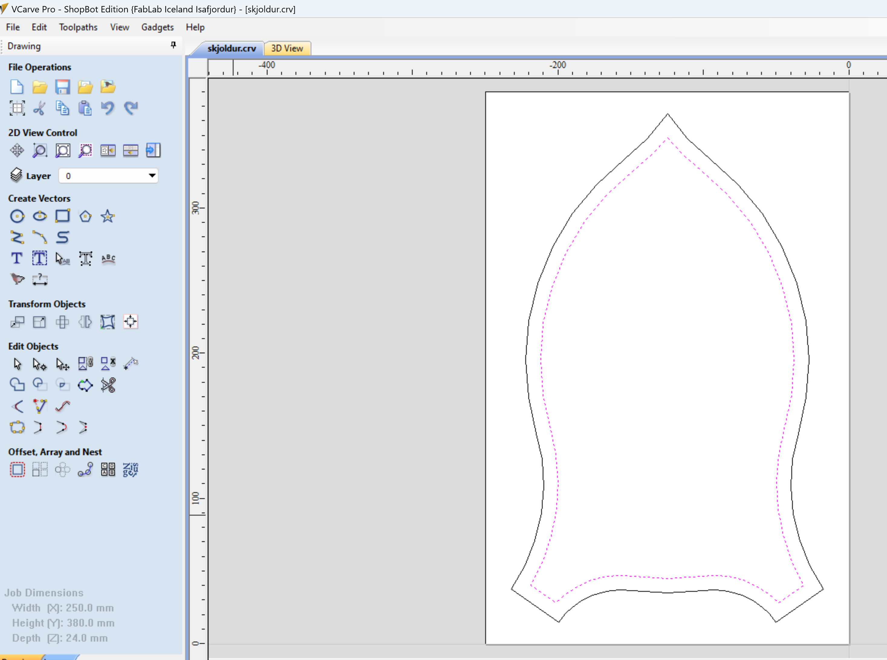
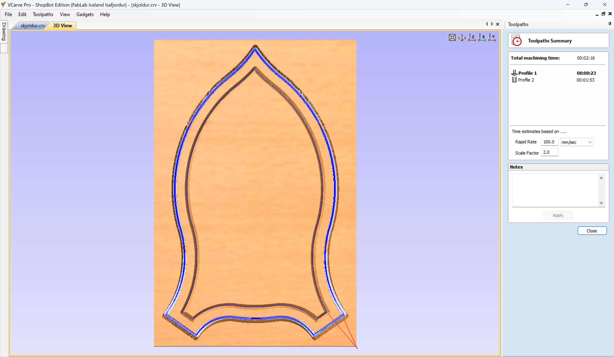
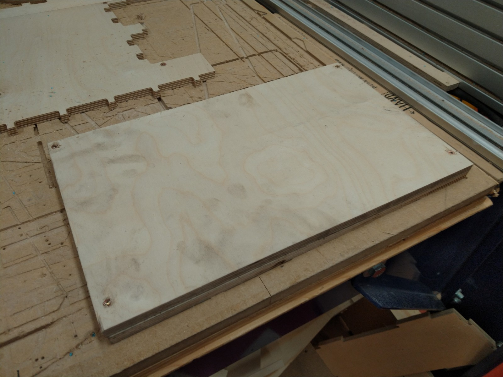
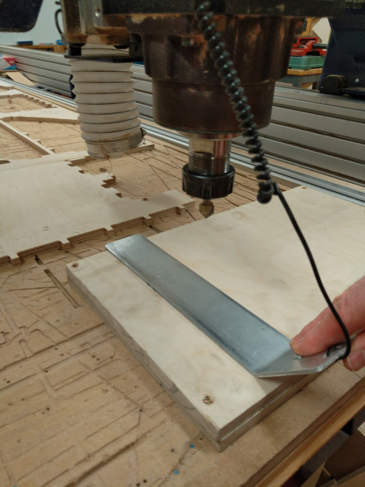
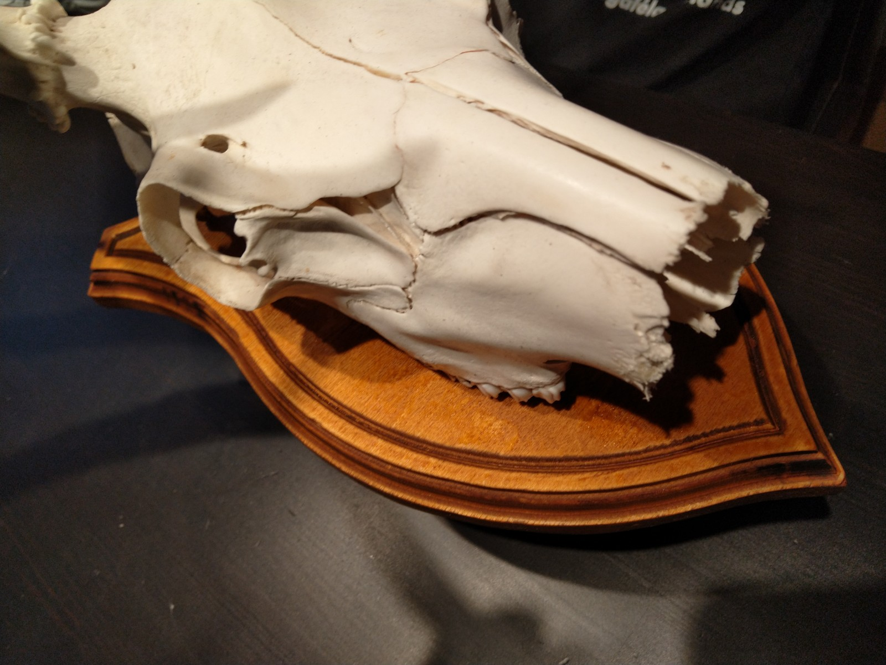

# Milling
In the preparation course I will use VCarve and the Shopbot to practice milling fabrication. 

The [tutorial](https://www.youtube.com/watch?v=pGVNDf1vgSI) recommended by my supervisor includes all important information. 

## The workpiece
As I wanted to make something I would actually use, I decided on making a trophy shield. 

I drew the outline in a sketch in Fusion 360, as I'm most familiar with that environment. Then I saved the sketch as a *.dxf file. 

Next I looked for scrap wood that is large enough. I found a piece of 12mm birch plywood that I could cut in half and glue together to double the thickness. 

## VCarve
I did the *Job Setup* and imported the dxf-file. Then I needed to align it to the center of the workpiece and mirror it to get the other half and delete some unwanted lines. 

Next I joined the open vectors and created an inwards offset to get another path for some more engraving operations. (Later I realized, that it is very easy to select the offset in the toolpath operation as well). 

Then it's time for the toolpaths. 
I used the *2D Profile Toolpath* for both the cutting and engraving operations, because I don't like, that the *Quick Engraving Toolpath* doesn't offer the ramp function. 
I selected a 1/2'' straight end mill for the cutting and a 90° engraving bit for the engraving. 

### Bonus - Adding a new form tool
I decided to add a custom form tool to make the outer edge look more nice. The only advantage of adding the custom tool is, that the preview will look as the real workpiece and it's easier to identify possible mistakes, otherwise you could use a normal milling bit in VCarve and put the form bit in the ShopBot, if you know what you're doing. 

I needed to draw the right side profile of the milling bit and with the profile selected went into the *Tool Library* and defined a new tool. 

Then I added another *2D Profile Toolpath* with an offset for the edge forming, using the new form tool. The resulting toolparts and machining preview look like this: 

Lastly, I saved the toolpaths into one *.sbp file. 

## Shopbot
I fixed the workpiece in the X/Y corner of the shopbot and picked the tools and collets I'm going to use. The spindle was already heated up, so no need to do that again. 

First is the V-carving so I put the v-bit into the spindle and used the auto-zero function with the aluminium plate. Also i set the X/Y zero point. Then I added an offset of +5mm to the Z-axis to make a dry run with the tool and check for clearance of the screws. 

When that was done, I readjusted the Z-offset and ran the first cutting path. 

That worked well, so I changed the tool to the 1/2 milling bit and did the zeroing for that. During this operation something went wrong and the milling bit cut too deep into the material and crashed into a broken screw, that was hidden in the machine bed below the workpiece. When I realized, what was happening and stopped the router, it was already too late. The bit was bend and the workpiece had become loose.

So what happend? Presumably, the feed/speed was too high for this bit and/or I didn't tighten the collet well enough. So while milling the first path, the vibration caused the milling bit to slowly move out of the collet and therefore cut deeper and deeper - increasing the load and vibration. 
If it wasn't for the hidden (broken) screw in the end, it would have survived, but unfortunately the bit bend during the collision.
As this also meant, that I had lost the alignment of the piece - I decided not to continue in the Shopbot and finish the edge milling with the third bit in my handrouter. 

The final result looks like this - not too bad for a rescued crash-piece. 

